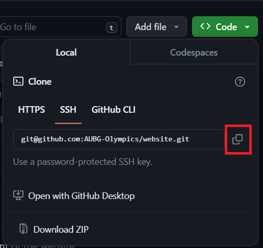

# website
This is the official repository which we will use for the development of the website.

**Workflow in the repository:**

- Cloning the repository:

1. Generate an SSH-key: https://docs.github.com/en/authentication/connecting-to-github-with-ssh/generating-a-new-ssh-key-and-adding-it-to-the-ssh-agent

2. Click on the code button, choose the SSH option and copy the generated link:

    

3. Open a terminal at a folder where you would want to clone the repository.

4. Run the following command with the copied link:

    ```bash
    git clone (link here)
    ```

    **Remark: If you are using Git Bash on a Windows, use Shift + Insert to paste the link.**

- Creating a pull request:

1. Make sure to checkout the main branch of the repository using the following command:

    ```bash 
    git checkout main
    ```

2. Pull the latest changes from the repository using:

    ```bash 
    git pull
    ```

3. Create a new branch:

    ```bash 
    git checkout -b (branch-name)
    ```

4. Make the desired changes to the code or the README.md file.

5. Stage either the desired files or all files with chages using:

    ```bash 
    git add ...
    ```
6. Commit the files using a commit message that either starts with:

    * chore: - for refactoring tasks
    * feat: - for adding a new feature
    * docs: - for making changes to the documentation (the README.md file)

    Command:

    ```bash 
    git commit -m "my-message"
    ```

7. Push the changes to the GitHub repository using:

    ```bash 
    git push -u origin (branch name)
    ```

8. Go to GitHub and press create a pull request. 

9. Assign anyone with Admin rights to review the pull request.

10. Merge the pull request once all changes are addressed.